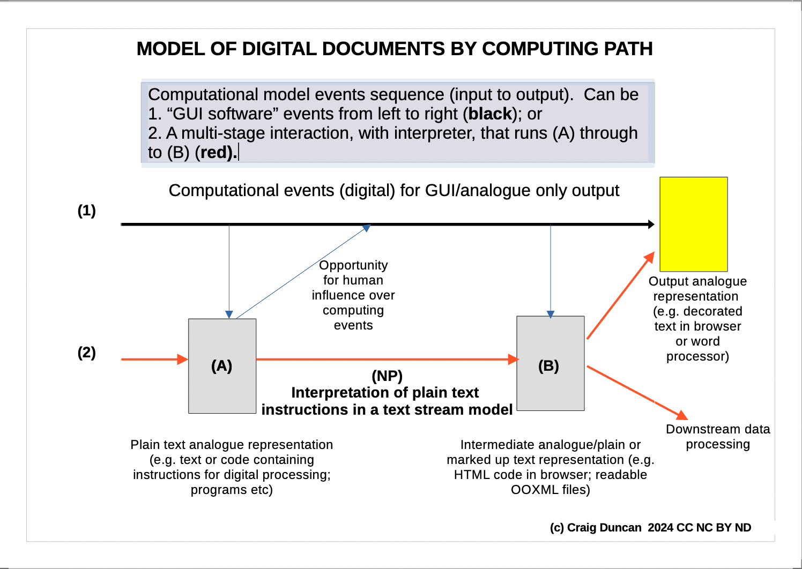

Comparative Digital Document Analysis
-------------------

A:Craig Duncan

D:13 September 2024

# Licence

See [Licence](LICENCE.md)

# An introduction to Comparative Digital Document Analysis

Comparative Digital Document Analysis is based, in part, on a model that analyses digital documents by how they are prepared, and what information is used in the computing processes by which they are prepared. It aims to compare :

- intermediate final representations of computer memory, and the data structures they are based on; 
- how much of a writer's semantic work-in-progress is available in a computable data structure throughout the process;
- analogue representations of computer memory at any point in the computational process (including final 'word processing' formats in analogue form); and
- how much the writer or human actor can alter the subsequent state of the digital computer memory through those intermediate analogue representations.

This kind of analysis helps us define a document in terms of its structure, function and ultimate goals within a computing process; not merely in terms of its superficial analogue appearance.   Even two digital documents with the same ultimate analogue appearance might have followed different preparation paths and so lead to different digital forms which are more or less useful for data analysis.

By introducing a model of computing into the analysis, I aim to go beyond simple binary distinctions between electronic and non-electronic representations of analogue documents.  I aim to ensure that digital media is understood not merely in terms of what is produced, but what choices have been made in the production of that digital media, and what kinds of software workflows can affect the human workflows that interact with them.  

This kind of historical analysis of digital computing paths works with 'computer events', and a kind of abstract notion of computing time which is related to the information that has to be read and interpreted, at different stages.   The creation of integrated word-processing software, that does not expose the internal computing events and assumptions to the end user, discourages the layperson from thinking about these sequences of events, and of alternative computing workflows.   Without an analyses of computing information paths, we cannot make informed decisions about what is computable or not, even in relation to analogue representations of documents. 

# Path-based analysis of digital documents

To help illustrate the computing path analysis, the following diagram represents some alternative computing paths leading to the production of a digital analogue document (yellow document).   The two main paths illustrated for contrast are:
- black (a conventional path where the analogue document is presented immediately), and
- red (with more explicit interaction with multiple stages, including programs, before the end of the process). 

# Interpretation of the diagram

The red and black paths can be seen as two alternative computing paths, as if there were two possible time-histories for reaching the point (B).  The software programs that are operating in each path look for and interpret the digital documents differently:
-  The GUI software interprets information primarily for analogue output in the yellow docoument above.  The production of any other analogue text at (A) and (B) is entirely optional, and if a text at (B) is produced by the black arrow process, it is not designed for open data.  Those analogue outputs would be discontinuous snapshots in that process.
- On the other hand, in the interpretation software along the red arrow path, the text at (A) is treated as both an input and an instruction list (or in other words, a program).  The programs that interpret the document at (A) will influence memory and functions that lead to a secondary document being created at (B).  

In the red-path computational model, the process begins with the computer interpretation of a digital text document (A), by the NP program, then the production of another digital text document (B) in a layout-orientated format, and then onwards to further digital processing.  It is possible that the same program will interpret the information from (A) to (B) and beyond.  The red arrow path can be motivated by at least two things:
- some anticipation that the content of the document will process as data; and
- a desire to save effort by allowing computing functions to be requested early in the process, instead of having to type everything.

To a human looking at digital documents (A) and (B) on screen, the information is analogue as far as they are concerned for reading.  We can only assess continuity of computing events between digital forms of (A) and (B) if the computer can pass information between those two points, independently of what a person is reading.

It is possible to move from one of these paths to the other, in an abstract sense.  For example, even though a program focussed on production of an analogue document (yellow document in the diagram), following the black arrow path, it is possible for it to offer to produce a document like the one at (B), which is a snapshot of an input document or a memory state.  A browser, for example, can choose to make HTML code, otherwise a <i>preceding</i> step in the computational model, available as another analogue output.  This is usually requested by a 'view source' option.  This does not prevent the same browser continuing to act on its internal memory content to provide a cleaner/decorated analogue representation (yellow document).

The possibility of different paths and cross-overs leads to the idea that we can influence digital documents in different ways, and with more or less control, by whether we deliberately follow something like the red arrow path.  For example, we can effectively merge the red path back with the black arrow path if we produce a document at (B) and then import that into a word processing program instead of doing separate data analysis on it.  Loading the HTML document will, in effect, fast track the final state to the yellow document <i>as if</i>i> that document had originally been prepared in a black arrow path software.

# Software development implications

The way in which human interaction with the computer at (A) leads to (B) is largely determined by how software is written, including any software interpreter for the text files that are used at point (A).   Our ability to analyse this process should correlate with our ability to write software that can introduce more control into these processes than might otherwise be available in commercial text editing software.  We are, in effect, required to implement a model of an abstract computer in order to handle the information between the inputs at, say (A), and the outputs at (B).

In general, to describe what happens at (A), and what kind of information follows the red path to (B), requires forming an explicit understanding of the relationship between an abstract model of computing for the entire path, and the information that is contained in relevant digital documents within that path.  This includes things like the goals of the software, data structures, programming languages and symbolic instructions to read from or alter memory.

The blue lines in the diagram above represent potential (but not necessarily actual) alterations to conventional GUI software, like word processing software, if they were to allow something like programming instructions at point (A), in order to produce the document at (B) (they generally don't).

Some workflows are arguably red-arrow paths, but do not extend past (B), and use a narrow model of computing.  For example, John Gruber's [Markdown syntax](https://daringfireball.net/projects/markdown/) was designed anticipting that there would be digital texts created and interpreted at something like point (A).  However the main goal was to substitute a simpler form of text symbols for actual HTML: it does not aim to implement any broader information processing, or model of computing that involves significant writer control over memory or data.   

