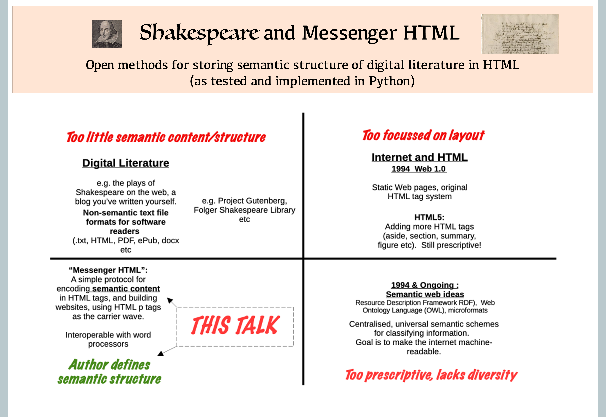
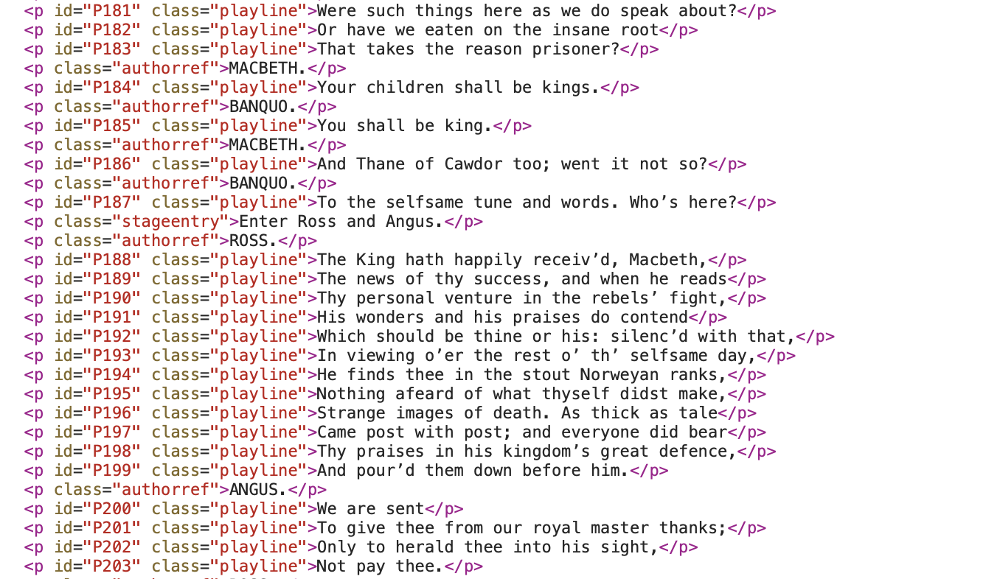
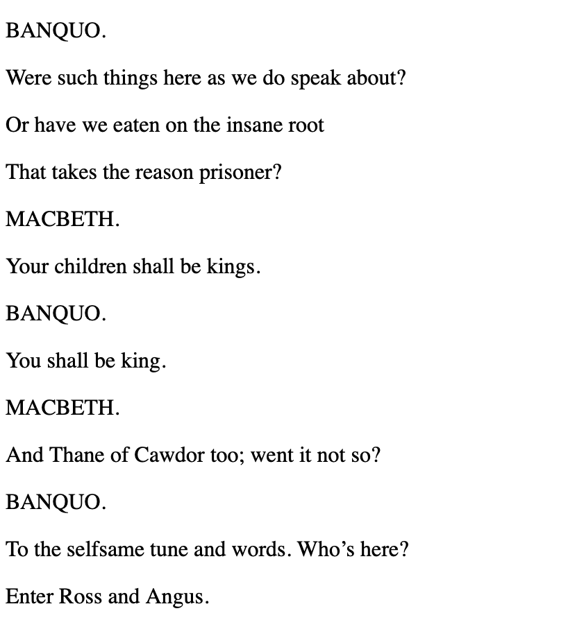
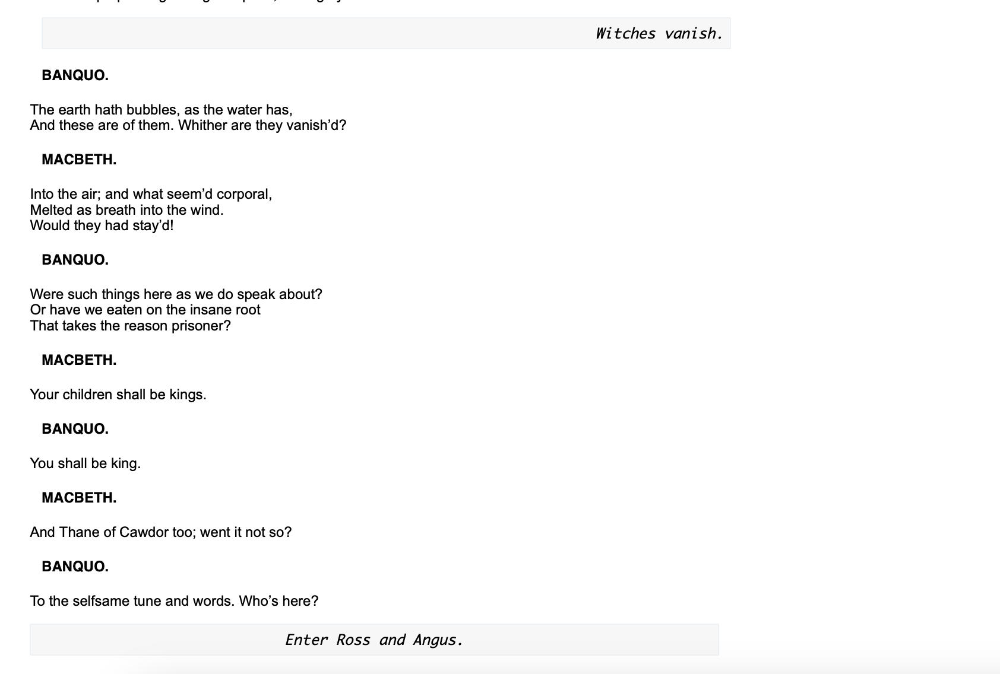
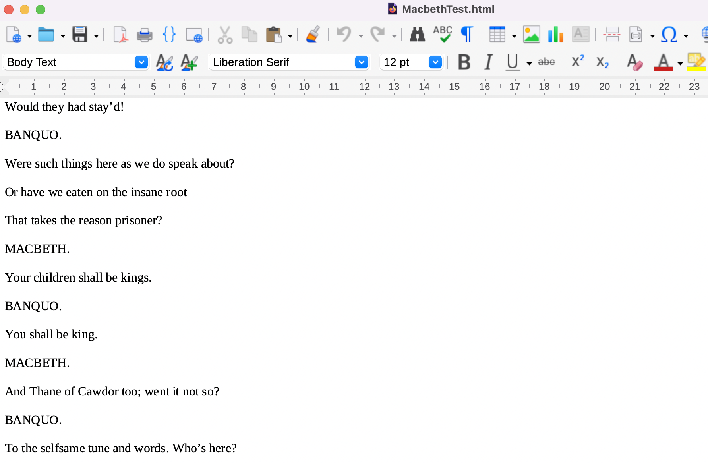
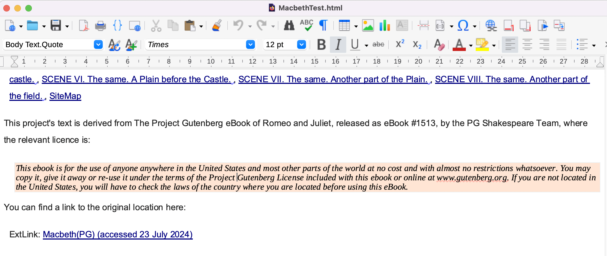
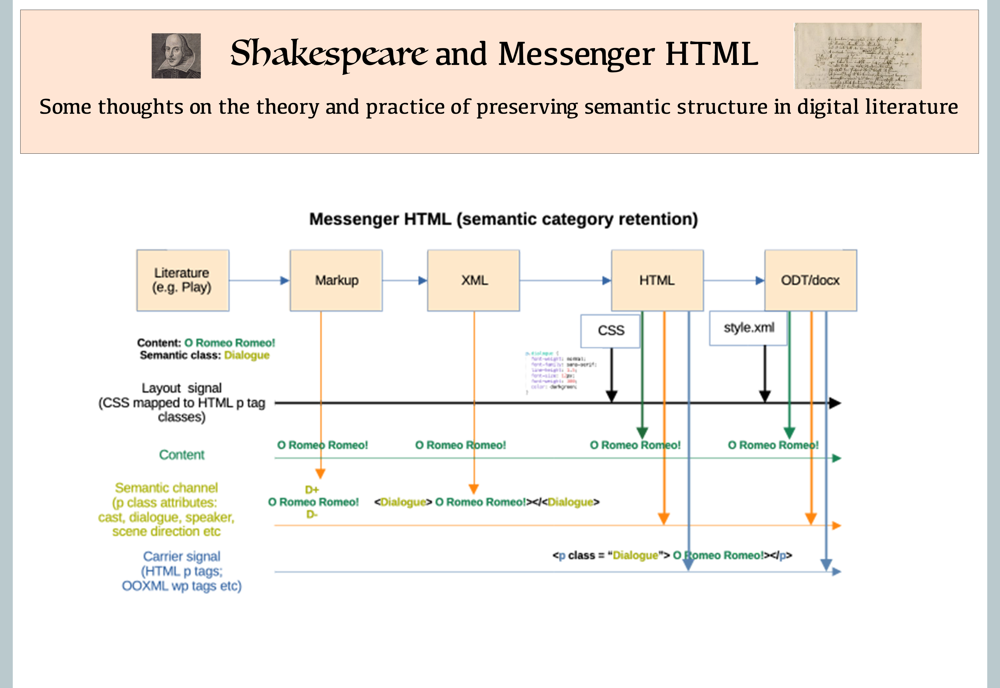

Messenger HTML - An Introduction
------------

A:Craig Duncan

D:12 September 2024

# Licence

See [Licence](LICENCE.md)

# Messenger HTML 

The purpose of this article is to raise awareness of how we can repurpose HTML as not merely a web page layout language, but as a digital communication and messaging tool for writing and storing literature.  Using HTML, writers would be free to choose the semantic categories they wish to record and work with, in any software or computer program, in the HTML document.  This would expand the ability of HTML to operate as a general purpose data format beyond visual display and printing alone.   Further, the specific way in which HTML would be repurposed allows it to be interoperable with word processors, a feat that other semantic formats like general XML and LegalXML are not capable of.  The presenter has described this way of using HTML to carry the semantic message of the author (and not some central standard) as a "Messenger HTML".

In saying this, we must distinguish this 'semantic content' in the form of Messenger HTML from other terms like semantic web and semantic HTML.  These have acquired specific meanings which are, in the author's view, too focussed on machine automation of information, or too narrowly tied to layout semantics.  has more in common with a repurposing of Web 1.0.  Since many of these other associations of 'semantic web' pay little attention to the semantic categories that an author or professional in the humanities, like an essayist, a playwright or even a lawyer would consider important, there is a niche for describing the actual protocols and software that might give them due attention.  This overlooked niche for HTML to act as a way of partitioning and classifying text according to a writer's flexible purposes is the focus of this talk.  

The theoretical potential of Messenger HTML, and an entire workflow from a markup language to the production of web pages has been fully explored and implemented in Python, so that we can discuss both the theory and practical software implementation of these ideas.

# General description

The repurposing of HTML to allow it to carry the semantic encoding that authors are interested in is inspired by ideas from information and communications theory.  For ease of reference, I am calling this protocol a 'Messenger HTML'.  In other words, the proposal is to treat HTML as a carrier wave, and the message is both the text and the semantic packages in which it is bundled.  Unlike the proposals for a strict ontology for the semantic web, I would leave it up to writers to determine what semantic schemes that they use and encode in an HTML document, or the humanities can arrive at their own flexible conventions.   

For example, a Shakespearan play could be partitioned within HTML into categories of data like character, dialogue, stage directions, teacher's notes, rather than merely as headings, paragraphs and so on.  An individual teacher might like to come up with their own scheme for their own classes.  Using HTML achieves the same benefits as XML, but with HTML providing the internet carrier stream, the ability to display it in browser (which also display source), and to pass it downstream to text editors or word processors if required.

To put this into context, I have also devised a quadrant poster which distinguishes between traditional HTML documents (in which 'semantic HTML refers to the semantics of layout), the 'semantic web' in its prescriptive form (which has detailed specifications and ontologies), and forms of digital literature which seem to use diverse text formats, but are actually just to cater for various forms of text readers, and none carry much semantic information.  There is therefore a missing quadrant, in which an author of a document seems to lack the permission, infrastructure or knowledge to create semantic content suitable for the web or word processors.  This presentation describes how this space can be filled with existing internet infrastructure and HTML protocols, as well as benefitting from a practical implementation in Python.

The use of HTML will not detract from the layout if the protocols in this presentation are followed, and yet would be a semantically richer form that that offered by Project Gutenberg and Folger Shakespeare Library.  On the other hand, it will allow downstream interoperability with word processors, and applications can be written that can then process the file as a data format.  If we consider the preprocessing of a markup file with the same categories into HTML, then the prior recognition of these semantic categories means we can produce filtered HTML (for example, one version of a page with a teacher's notes, and one without).   

In this essay, the topics are illustrated with reference to the format of a Shakespearean play, Macbeth.  For specific comparisons with how this play is elsewhere published in HTML and other formats by different organisations, see [ShakespeareAndMessengerHTML](ShakespeareAndMessengerHTML.md)

# The use of HTML as a messaging system

The need for agreed specifications in communication systems like the internet is obvious, but for messages to be successfully coded and decoded requires only that the sender and recipient know how to read messages.  This can vary for different purposes, so that a simple form of encoding is needed to turn something into visual information, and different kinds of information are used to decode the human meaning of the message.  It turns out that for browser purposes, the labels for HTML tags do not matter, semantically, to the browser if they can be cross-referenced to style properties like those in CSS.   A p tag might as well be an H1 tag if the style information is the same.   Applying a reductionist approach, all tags for encoding a simple work of literature as a 'message' can be p tags, and yet still be differentiated for layout purposes by the p class attribute.

This is a portion of MessengerHTML generated for the play 'Macbeth', showing both paragraph numbers and semantic categories within the p tags:

In HTML, the 'class' attribute may well have been intended primarily for fine-tuning of stylistic information, and it has since been widely used by content management systems for enabling some context-specific decoration.  In fact, due to its being a single data slot, some systems, like Wordpress, try to leverage more complex systems by having multi-term strings in the class slot.

# The relationship between analogue layout and semantic data in the 'class' attribute

For present purposes, however, what is useful about the class attribute is that it is a free slot that is also given reasonably high priority in the internet system.  It has achieved notoriety for containing high-level instructions for text decorations in the analogue representations.  I see this as particularly important for how humans will, unconsciously, also tend to imbue the explicit analogue representations with implicit semantic importance.   My philosophy is that instead of leaving the association of an analogue style with a semantic category to chance, we should start by encoding with semantic categories, and then ensure that the related style (if it is other than the default paragraph style) should be adjusted accordingly.  That is, we make layout dependent on the writer's semantics and the computable data, rather than the other way around.

Both the class slot contents, and the 'styles' names in CSS and in word processing are not important for functionality.   Conveniently, in both the web and word processing, data formats, styles are attached to each base unit of information (e.g. p tags or wp tags), and so style names can be  repurposed as semantic classifiers, without loss of the ability to include style definitions for layout.  

Based on the above, we can repurpose HTML to carry semantic data in its p tag structure if we use the class slot to carry semantic categories determined by the writer or author (or are appropriate for a recognised genre, like a play).  This approximates what XML definitions and schema do, but it need not be too regulated provided there is an appropriate style mapping.  This implementation of an XML-style semantic encoding in HTML is not present in most digital forms of publishing literature today.

Two HTML documents can appear to be identically styled in a software reader, yet one of them can also include richer data structures in its HTML encoding. 

# The role of Browsers and CSS for both semantic and analogue representations

HTML data structures are not visible in the main browser view, they usually only appear in the 'view source'.  

The connection between semantic encoding and layout in MessengerHTML is based on the use of Cascading Style Sheets, due to the convenience of these being interpreted by the browser (and other programs that recognise these internet conventions).

If no CSS sheet is supplied, or CSS styles are turned off, MessengerHTML will still supply structured data to the browser, but it will only look like this in the analogue representation:

The introduction of a CSS sheet to map to the semantic data categories results in the browser representation being as follows:

# Interoperability of MessengerHTML

Since semantic categories can also be encoded in word processors as style names, we can rely on the importation of suitable formatted HTML to retain semantic/style information in the word processing context. Whether there are any obstacles to implementing this requires practical testing, as detailed below. 

It seems that whatever CSS file is referred to in an HTML page must be present for the native importers in LibreOffice and MS Word to also recognise the p tag class attributes as semantic (style) information.   They do not make that connection from the HTML and then omit the style content; they fail to make it at all.

For example, if LibreOffice is asked to import the MacbethTest.html file without the pre-requisite CSS file being present, only a simple, readable plain text format is obtained, and no styles information is present.

However, when the CSS file referred to in the HTML is present, then LibreOffice will simultaneously import the semantic information as styles, and link it to the appropriate paragraph of the text.  In the picture below, you can see this from the style names (e.g. 'Body Text.Quote').  The only difference in process being the presence of the stylesheet fnlstyle_new.css when the HTML file was opened by LibreOffice:

In summary, for a user-defined semantic encoding of HTML to be successful we need these conditions to be satisfied:

- we have style(semantic) information in the 'class' attributes of p tags.
- Secondly, we need to consistently implement the writer's semantic scheme within the attribute tags of the p tags in HTML.
- appropriate CSS file information must be available when opening HTML files to assist with default HTML import procedures in LibreOffice and MS Word (for example).

# Auto-tagging

There are still opportunities for customising the way in which semantic information is pre-processed into HTML, and for automating the build of static web sites that follow the semantic guidelines.  

For example, by taking a Project Gutenberg document, such as Macbeth, and adopting some of the functions I have created for the New Processor, it is possible to achieve the styling illustrated above using a rule-based, pattern-matching approach, rather than having to encode each line.   This achieves the goals of Markdown but does so using a simple programming language approach, which can easily be integrated into a file, or by using the <i>import()</i> command.

In this way, the advantages of this system for individual literary documents can be extended to blog-style writing, research, or even to a wiki-style encyclopaedia of information.  This has already been implemented successfully in Python.

# Practical pipelines

This increased interoperability provides new opportunities for semantic encoding, but it also places demands on workflows to preprocess HTML into an appropriate, restrained form where semantic categories are explicitly tied to tag attributes.  This preprocessing of HTML step occurs anyway when people use markdown for writing, so we don't need any substantive changes to the steps in our writing workflow; we merely need to make intelligent HTML parsers that will turn markdown into semantic categories.  
Implementing these ideas is where Python comes in.  I have used Python to write and implement the integrated NP (New Processor) and MessengerHTML pipeline. This includes:

- a markdown script environment that allows writing easily, but also allows the writer to block out, or mark the different types of information.  The tokens for markup can be arbitrary: all that matters is that are differentiable from each other;
- an HTML process that preserves the p tags as the communication channel and the class attributes as the message channel; and
- a means by which the labels attached to class attributes can be labelled to reflect whatever semantic scheme that is important to the author
completion of the HTML preprocessing system by writing the author's custom classes into the subclasses of p tags, so that the layout layer styles are seamlessly integrated with the semantic scheme.

The entire toolchain, written in Python (&lt; 200kB) produces HTML output for browsers that is also compatible with the usual word-processing environments, and requiring no third party file converters (simply open as HTML and styles are imported as well as semantic categories as style names).  Other toolchains, including those using pandocs, often do not do this.  

By needing to balance the author's semantic categories, on one side, and the demands of word processors, on the other, the toolchain required a holistic design and a cleaner, semantically-orientated HTML.   The author has used R Studio and similar applications to build markdown based HTML, but at over 1 GB those applications are far bigger than necessary for the task at hand, and not as focussed on semantics.

The software design specifications for producing MessengerHTML as standard output include : 

- making the text file both a raw data and scripting environment to automate HTML table creation and image annotation (unlike notebooks which are themselves HTML formats);
- adopting word processing conventions like automatic paragraph numbering for HTML output, as well as enabling paragraphs to be link targets;
- automating index creation by date and article, and creating a Site Map that inherits the structure of the source folders, for flexible modification;
- ensuring the resultant HTML is ready to be opened in native word processors like LibreOffice or MS Word, without loss of semantic or style information (i.e. styles are semantics);
- ensuring HTML is clean, javascript free and can be read independently of its CSS file if required; and
- making the application modular, and as small as possible.

The application is easily processing over 800 source notes and essays into an integrated, indexed static web site.  It has also been used to prepare a small travel diary website, with annotated images that are automatically resized using the Python scripts.  

# Resources

I have included a diagram that summarises the conceptual layers I use for the Messenger HTML model here:

# Conclusion

In conclusion, instead of expanding the range of semantic HTML tags to accomodate semantics for limited purposes, it's better to allow the flexibility for user-based, or genre-based semantics.  Not only does this give power to writers to define their semantic schemes on their own terms, it's actually better for interoperability.  

This can be realised by the separation of communication channel, semantic channel and layout definitions allows the receipt of information by different software to immediately preserve those elements and apply their own, localised functions to them.  It gives the ability of a Word processor to not only display layout, but preserve the semantic content.  With only small adjustments, the way in which the same software passed that information back to the input format could also become cleaner and more focussed on preserving the separability of these three elements.

The ability to allow writers to individually define their own semantic categories does not prevent existing software and infrastructure from finding the information for layout, but what it adds is the ability for ordinary literature and writing to reflect human choices and semantic content better than trying to specify it all in advance in HTML tags or some XML data definition. 

