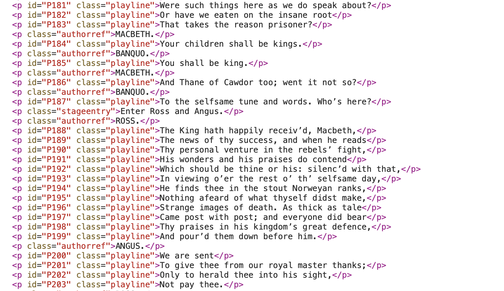

The 'NP' (New Processor) Guide
---------

This Guide (c) Craig Duncan 2024.

# Licence

See [Licence](LICENCE.md)

# All you need to start writing

*Default paragraphs*

Any text that is not in a data block, and does not use a command or a reserved prefix, is treated as the default paragraph style/code (np).  The text will be processed into HTML with the np class, and this np class is in the default CSS file with the project.

Default paragraphs are in an essay style by default.  You can change the default potions to make literature style indentation, or paragraph numbering.  

If you wish to specify another semantic category to act as the default paragraph, use this function in your text:

```
defaultpara(playline)
```

substituting 'playline' for your chosen style.  The style must be present in fnlstyle.css or whatever .css you are using.  'playline' is provided with the project as a convenient and tight formatted line.

*Text decorations*

Unlike Markdown, the NP processor will support underlining natively.  Although rule-based processing is encouraged, there are many instances where ad-hoc emphasis might be desired, in which case you can use the following:

```
!_some text_! for underlining
!!some text!! for italices
!*some text*! for bold
!! !*some text*! !! for bold and italics
```

These options are some of the reasons why I now prefer working in NP in preference to Markdown.

*Paragraph numbering*

All paragraphs are numbered with sequential IDs in the HTML files, even if the paragraph numbers are not shown on screen.

If paragraph numbering is on, default paragraphs will be display hard-coded numbers. 

You can setup paragraph numbering options using either config.py (general option) or use the paragraph() command in your file. (see overrides.py)

The paragraph command has three basic options:

```
paragraph(default)
paragraph(essay)
paragraph(number)
```

Visible (hard-coded) numbering for default paragraphs is turned on by the third option, and off for the first two.

The essay option will indent the first few characters of every default paragraph.

This is a portion of MessengerHTML generated for the play 'Macbeth', showing both paragraph numbers and semantic categories within the p tags:



# Essay or blog metadata and reserved header prefixes

The program assumes that general metadata for an article, essay or simply a blog page will appear in the first 10 lines.  You do not need to follow YAML.  Instead use this convention for prefixes (order is not important), including prefixes for high level navigation.

```
T:Title
A:Author
D:24 March 2024. Last update or revised 1 June 2024.
C:Concept, abstract or general description.
R:PageNames
B:BackTo
F:ForwardTo
```

You can include some explanatory text in the date line (as above), so long as there is a long form date that can be detected somewhere.  The right-most date is chosen as the latest date, and it will use this for document indexing (it doesn't check the date sequence only that it is the last).

If there is no date, the document is not included in Date or Article indexes, so use as you feel like.

R: is an optional link to another page in your project, as are B: and F: options (back and forward respectively).  Follow the convention that you need to use the same filename as your source .txt file, but without the .txt suffix (this forms the basis of htmlpages page names).  So if you want to go back to 'MySoftwareProject', enter:

```
B:MySoftwareProject
```

The difference between R and B,F options is that R can include several page names, separated by commas.

A link to SiteMap will be included at the end of automatically generated page links, as well as at the bottom of each page.

# Syntax for basic navigation level headings

The 'intro' paragraph type is indicated by a hash (#) like this:

```
# This is a heading or 'intro' paragraph
```

# Links

*Project HTML Page Links*

One of the real practical benefits of making web sites with NP is that you can simple enclose /SomePageName/ with angled brackets and it will create a link to it (regardless of where the .txt file is in source, because all htmlpages are flat links).

The objective of this syntax is to make it very easy to refer to pages that are .txt files in the same project (source) by just using angled slashes to enclose the name of the source file (with no suffix).

*Internal Page Links*

You can extend this to linking to a heading (intro) paragraph in a page with: /SomePageName#IntroHeadingText/

Also, because every paragraph (and heading) has an in-built numbering scheme, you can link to a specific paragraph in any page in the web site like this:

/SomePageName#P12/ where P12 is used for the 12th paragraph.  With paragraph numbering turned on, a reader will already be able to see what paragraph this links to in the browser rendering of the page.  If paragraph numbering is off, it may be necessary to look at HTML source to see it.

*External URL Links*

There are several ways to enter links in the body of the text.

Basic prefix methods for an external link include:

```
E:LinkText,www.linkaddress.com,23 April 2024
```

The date is optional but by including it you get words indicating when last accessed.

There is a parsing method that will ignore any additional commas in URL between the first LinkText and the date.  This means links to sites like Google Maps with location information separated by commas will be interpreted correctly.

# Data Blocks

Data blocks are a useful way of storing text data with a variable name to be able to use it in a function later.

Reserve a data block with the d+ and d- tags (see below), and put a variable name in the first row, enclosed in brackets, like this:

```
d+
(dramatis)
PRINCE,
ESCALUS, Prince of Verona.
d-
```

A unique feature of data blocks is that the text will never appear as output without a helper function.  i.e. they are not immediately part of HTML.  They are also not 'code'.  Think of them as raw data, or provisional text.

Raw data in a data block can be text, or a list (line separated), or some other ad hoc format where each line is potentially a 'row' of data.  

The philosophy of data blocks is that they are raw data with no expectations except that each line after the variable name in is treated as a new entry for the first stage of data processsing, whatever that may be.

The default use is that you put all your data in a data block into the system using a single variable.  You can then create new variables, if you need to, by splitting the raw data that is already in the row entries.  To do this, you have a range of options for specifying headers and delimiters.  You will need to use the header() function and the rip() function in succession.   The 'NotesOnGutenbergMacbeth.txt' in the source/Plays folder has more detail. 

You may not need to do anything to your data block if it is just a list.  You can use one of the print commands with it immediately.  If you do want to manipulate the data in a data block, then your options include using the functions in the 'Raw text manipulation' section, below. 

# Images

My preferred approach at present is to take in image data in a data block, like this:

```
d+
(Image1)
MyImageName.png
A:This ithe author name
C:This is the caption
T:This is the title (alt text).
d-
```

There are some prefixes (as shown above) that will enable the subsequent processing of the data to understand what you want to do with it.  You do not need a prefix for the image name.  Both jpg and png are recognised.  mp4 is also recognised, but it may not show in all browsers.

The image will not appear until you enter a line in your text file like this, with :

```
image(Image1)
```

You can see an example of this in the 'NotesOnGutenbergMacbeth.txt' file in the source/Plays folder.

The program will use as much or as little information as you give.  It recognises .png and .jpg or .jpeg files (and .mp4 if you use Safari, but not Firefox).

# Using the data print functions

Using data block variables means that you can reuse data in different ways without having to re-type it.  You can also postpone using it until you are ready.

In general, some variation of a 'print()' command (see below) can be used to output a datablock to HTML at the point in the file where you want to see it as HTML output.  These also allow you to customise how it appears in the HTML, without having to use markup in the text supplied as raw data.  

The variable name can be used in available functions.  A few of these are:

- lprint(arg)  = print as a list
- nprint(arg) = print as a sequentially numbered list
- qprint(arg) = print as a quote block
- tprint(arg) = print as a table (it tries to find the most common delimiter)
- codeprint(arg) = print as code style
- eprint(arg) = print as example style.  A tight font with coloured background.
- qprint(arg) = print as quote style
- cprint(arg) = a shortcut to cricket scoring tables (with sums).

For example, include these lines in your .txt file and experiment:

```
d+
(MyList)
Here is something
That I want
To print in different ways
d-

This prints as a list:

lprint(MyList)

This prints as an 'explain' text box:

eprint(MyList)

This prints as numbered list:

nprint (MyList)

This prints as a quote block:

qprint(MyList)
```

Some of these shortcut the process of taking in raw data and then splitting it for table purposes.  For example, tprint() is a basic table maker that looks for the delimiter and then just puts numbers for row and columns, and doesn't wait for you to specify a heading.  There are some examples of this in the MathTest.txt file in the source folder.

In addition to the above commands, there is also a block shortcut syntax that enables you to define a block of text which is both a data block (usually defined by d+ and d- end codes) and an instruction to send it to HTML in a particular form.  See 'Shortcut Blocks' below.

# Shortcut blocks

I am experimenting with the utility of shortcut blocks.  The idea is that they combine the convenience of a data block with the call of one of the print functions immediately (i.e. no delay in HTML output).

So far, they seem very useful but they do not have any memory/buffer use.  For example, you can block in lists with l+ and l- lines like this:

```
l+
This is a list item
Second line
Third line
l-
```

The advantage of this over markdown is that you only have to cap the top and bottom, and not mark up each line.

Similarly, there are shortcut blocks roughly corresponding to the print functions above, namely:

- q+/q- = quote block
- c+/c- = code block
- e+/e- = example block
- n+/n- = numbered list block.

# Tables

Unlike Markdown, tables are initially defined as data objects.  This means you can create one using the shortcut functions (above) or by using a data block.  If you use a datablock, you can do this by:
- setup a data block with your raw data 
- set your headings (i.e. column labels and variable names for each column) using header()
- process the block into column vectors (rip or split function)
- choose which column vectors you want to print by putting the column heading names into the tablecol(arg1,arg2,...) function

There are some quick and dirty ways to make tables, including the tprint() command, but if you follow the more detailed process just described, you can be quite specific about the data in 'column vectors' that you combine to make tables.

If you have some complicated raw data you want to include in your text file, and then still manipulate that raw data into tables without having to manually 'draw' the table, as in Markdown, see the next section.

# Page headers for navigation

*Intra page links for navigation*

By default pagelines that act as a table of contents appear at the top of each html page, based on the 'intro' paragraphs.  This means that any of the '# ' prefixed lines will act as a form of navigation without anything needing to be done.  However, if you want to change this to some other semantic category, like 'scene' paragraphs in a play, use:

```
pagelinks(scene)
```

# Raw text data manipulation 

*Delimiter selection for raw data*

You may not need to do anything to your data block if it is just a list.  You can use one of the print commands with it immediately (see below).  However, for some purposes, you may wish to do some splitting of text and then use some of the newly constructed lists (e.g. for tables with parts of the data).  This is made possible by the data splitting commands, used in a sequence.

Raw data can be comma separated, space separated or even use a completely arbitrary but regular set of symbols for each column.  For example, you might have data separated with a colon (:), then a semi-colon(;) and then a comma(,).  You can set it up for data splitting to recognise the first instance of these.  This means that any commas before the first colon will be ignored, but those after a slash will be used as a delimiter.

The function that will carry out splitting for you is dlim() or splits().  You have these basic options, that can be combined:

- dlim(comma) = split on the first comma
- dlim(comma,comma) = split on the first two commas etc
- dlim(comma all) = split on all commas, like CSV format (each line)
- dlim(comma,colon) = split on the first commas, then on the first colon.

The range of delimiter options is catered for in datafunctions.py.  They are entered using a keyword as argument to dlim(keyword).  These include:

```
space
equals (=)
bar (|)
lcurly   = (
rcurly = )
lsquare = [
rsquare = ]
csv, comma = ,
colon = :
dot = .
semicolon, scolon = ;

The keyword 'all' added to any of these key word options will allow any number of the delimiter in each row to split the data.  e.g.

dlim(comma all)
```

# Commands availale (data processing functions and HTML output)

Default paragraphs in your text file are always processed to HTML output.  You do not need any markup for them.

There are several functions that help you to process a datablock, or set up some other text streaming function that might be useful for the processing the subsequent text in your file.   If you wish to add data, a command, or call a function based on a variable defined in a data block, you can use any of the commands provided by the NP software.  If functions require a variable name as an argument, then you need to ensure that there is a datablock that defines the name first (or that you have created a new variable by splitting the data with a rip() or splits() command).

The full list of commands is in commands.py and they are grouped into these types of functions:

- AutoTag 
- Table
- Image
- Code
- Data
- ParagraphOptions
- Math
- Cricket (for fanatics only)
- Print

# Example of commands used to process Literature

This is an example of putting data in (the commas in the data are not initially used when ingesting the data, but will be used to split the data for other purposes)

```
d+
(dramatis)
PRINCE,
ESCALUS, Prince of Verona.
MERCUTIO, kinsman to the Prince, and friend to Romeo.
PARIS, a young Nobleman, kinsman to the Prince.
PAGE, to Paris.
MONTAGUE, head of a Veronese family at feud with the Capulets.
LADY MONTAGUE, wife to Montague.
ROMEO, son to Montague.
BENVOLIO, nephew to Montague, and friend to Romeo.
ABRAM, servant to Montague.
BALTHASAR, servant to Romeo.
CAPULET, head of a Veronese family at feud with the Montagues.
LADY CAPULET, wife to Capulet.
JULIET, daughter to Capulet.
d-
```

Now this is how we can split the data and use it for a table.  First, we create our header lables (these will be both table headers and variable names)
```
header(Character,Description)
```

Then we specify the splits.  This is a single comma.  To specify multiple commas you can list them (comma, comma, comma) or just (comma all).
```
splits(comma)

or 

dlim(comma)
```

Now perform the split.  You can use the keyword 'datasplit' or 'rip'.  This will create two new column variables, based on the header.
```
datasplit(dramatis)
```

Finally, to make the table appear, you now use whatever column names you want, in whatever order you want them to appear:
```
tablecol(Character,Description)
```

# Auto-tagging

Now if we want to experiment with changing the appearance of plain text and creating semantic categories without markdown, we can use the 'autotagline' command.  The basic syntax of this command is:

``` 
autotagline(dataline,style,case)
```
Where:

- dataline = Data list to use (e.g. a list of text string.  These could be the characters names you want to find on a given line in the file). 
- style = a recognised stylename in your CSS file
- case = on/off for case-sensitive matching on the dataline entries.

Specific commands that format the plain text in Gutenberg project for CSS use, without markdown
```
autotagline(EnterTag,stageentry,on)
autotagline(ScenesTag,scene,off)
pagelinks(scene)

autotagline(Character,authorref,on)
defaultpara(playline)
outertag(stagedir)

autotagline(ActTitle,title,on)
```

The outertag looks for square brackets at the extreme left and extreme right of any line.

# Auxillary files and import(file)

You can put functions in between normal text in a text file, but if you want to bring in the text from another file, you can also the 'import' function.

The import function will import a file with an .ats extension (this can be changed in the config.py file).   This file is just a text file which is otherwise identical to the normal .txt files that are processed by the NP interpreter.

The text file loaded by an import command may include data blocks, or functions, or additional text.

The import command allows re-use of any data definitions and autotagging commands that have already been prepared.  It is also a way of bringing in data, functions or other text without interrupting the read-through text of the main document. 
