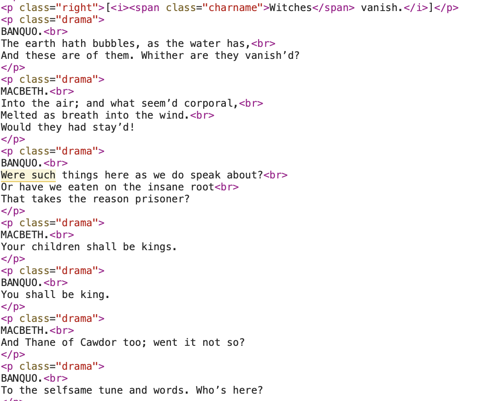

Shakespeare and HTML for Literature
-----------------

*(Open Data and using HTML as a dual format for data and layout)*

A:Craig Duncan

D:12 September 2024

# Licence

See [Licence](LICENCE.md)

# Introduction and benefits of semantic HTML for literature

When HTML formats are provided for e-readers or browser books, then the trend is that it is provided as one of a number of reader formats (HTML, XML, doc/x or PDF forms, for example).

On the other hand, none of these HTML formats, within their tags, encode the information in such a way that it represents a complete set of genre categories, like 'character', 'dialogue', 'location', 'stage direction'.    If this was included, then it would still be possible to apply different styles and layout to each of those tag categories, but we would retain the ability to process that information as data. 

Some will say that XML is the preferred approach, but XML schemas often try to be prescriptive, without flexibility, and they aren't designed for browsers.  In a writing community, and for freedom in messaging of any kind, I think it is helpful to be flexible in terms of semantic information and messaging.  I propose that we focus on ways that any kind of semantic scheme could be woven into HTML format.  There is scope for further investigation and testing, and literature is as good a place as any with which to test these ideas.

I offer these ideas about how to improve the situation, and how we analyse digital documents:

- [MessengerHTML](MessengerHTML.md) and [New Processor](NPGuide.md); and
- [Comparative Digital Document Analysis](ComparativeDigitalDocAnalysis.md)

# The diversity of digital formats in published e-literature

We can illustrate the diversity of semantic or non-semantic information in HTML forms of literature by comparing how Shakesepeare's plays are published at Project Gutenberg (in multiple formats) and at the Folger Shakespeare Library.   

# Project Gutenberg approach

Historically, Project Gutenberg was created to to makes texts accessible in a readable form on the internet.  The focus was on analogue representations in a digital medium.  And yet, in many ways, the HTML used for this does succeed in keeping to the original importance of p tags and adds some semantic data in a way which is helpful.  By doing little to upset the simplicity of HTML, it succeeds in maintaining its ability to exist as a data format too.

Here is the link to Project Gutenberg's HTML and ePub versions of Shakespeare's play Macbeth [Gutenberg_Macbeth](https://www.gutenberg.org/cache/epub/1533/pg1533-images.html).  

Here are some relevant observations about the current form of Project Gutenberg's HTML documents.

The HTML form of representation in Project Gutenberg is relatively clean, and it incorporates some degree of semantic tagging.  This illustrates something of what MessengerHTML is about.  Here is a section of the play MacBeth as it appears in the HTML at the above linked page:

A single paragraph class of 'drama' is used to include both a section of dialogue, and the charactor that is speaking.  Because the information is separated by a line break character, it is neither easy to parse tags/attributes or apply styles within normal HTML conventions. Here is how the HTML provided by Project Gutenberg looks in a browser:

Project Gutenberg is an excellent project, and the HTML it provides is, in my view, a better general purpose open data format for literature than either Folger's e-book form HTML, or the researcher's XML (see below).  It is likely there are opportunities to modify the workflow of Project Gutenberg to think about some of the missed opportunities for more open data for literature.  I think this includes the opportunity to incorporate semantically-informed data structuring as part of the information provided.   As such, possibilities like auto-tagging the text have also been missed.

There are still opportunities for improvement in the use of HTML for both open data and readable literature that can be taken by Project Gutenberg.

# Folger Shakespeare

We can compare Gutenberg's approach to a well funded site, like the Folger Shakespeare Library, where there are resources for converting manuscripts into XML, and for providing web-based access to Shakespeare's works, in many forms of media, including audio and video (see [Folger](https://www.folger.edu)).  

You can also read the plays, like Macbeth (see [Macbeth_Read](https://www.folger.edu/explore/shakespeares-works/macbeth/read/)), and download a version of the play from there.  

The HTML format provided by Folger is not a single HTML file with CSS but is a folder with multiple files designed to provide an aesthetically pleasing, browser-as-book (i.e. e-reader) kind of experience.  There is an XML form provided, but it is not one easily explicable as related to that HTML file at all (see further, in the next section).

The word-processing download formats include DOC but not DOCX (the more recent, OOXML based format).  The DOC form is quite outdated and still in a non-readable proprietary form. At least in OOXML we would have something closer to a human-readable format that exposes the nature of w:p tags and style information in such a way that we can consider making HTML formats compatible with it.

# Evaluation of the Folger HTML format

If you inspect the HTML you will see a very surprising thing: the basic paragraph tag system stops at about line 183, and thereafter it is just span and div tags.  To be clear, in the early part of the HTML, written notes from the Director of Folger Shakespeare, Michael Witmore, appear in p tags, like this:

However, the play itself has a much longer stream of non p tags arranged more like this:

This is clearly arrived at in reverse - by finding some arrangement of HTML tags that suits the analogue representation that is intended.  It is quite idiosyncratic.

Even though programs like Beautiful Soup could be available to do data scraping, it is an inherently time-consuming task, and in this case trying to obtain a simple semantic form would be time consuming.  For institutions that are interested in the public scrutiny of literature (especially that outside of copyright), and its longevity in a digital form, it would seem appropriate to think about <i>*both*</i> the computability of the format and its aesthetic analogue appearance. 

# Evaluation of Folger XML Format

On the other hand, Folger does produce an XML format which is intended for more data-savvy digital humanities professionals and manuscript researches.  Here is an example of the same lines from Macbeth, given by Banquo, as they appear in the Folger XML format:

Compared to the Project Gutenberg HTML, the XML digital tagging produced by Folger goes to the other extreme, in that the data structure is not based on the recognisable semantic categories of the genre (characters, scenes, stage directions etc).  This is probably because it is intended to capture the source manuscript features in detail.  As the Folger institutes notes inside the XML:

<blockquote>The primary goal is to represent the source text faithfully, as simply as possible within the TEI P5 schema. Lineation and other typographic features from the print edition are reproduced, with the interpretations previously implicit in the print layout now made explicit in the encoding</blockquote>

# Conclusions about Folger formats

In the case of Folger's documents, neither the HTML, or XML, is particularly 'simple'.  The comment about offering source text 'as simply as possible' is qualified by saying that it is 'within the TEI P5 schema', rather than in general.  Such schema deny the average researcher the possibility of participating in a computable, open data environment where they can easily work with digital forms of text independently of a chosen analogue representation.

The Folger documents provide diverse e-reader formats but all suffer from the same lack of concern for any format being used for open data.  Part of this project's goals is to raise awareness of how this can be done, particularly amongst those interested in Open Data.  

# Comparison with MessengerHTML approach

The MessengerHTML approach, without complicating features, is a resource that is one step better than plain text, and allows a lot of simple computation in any general programming language.  Putting semantic information into the class attribute of p tags makes it relatively easy to scrape text using python programs like Beautiful Soup.

Such simple computation allows people to work intelligently with texts, insert additional information, or filter it.  There is enormous scope for doing more if the original data is clean and structured, whilst remaining visible in the browser. 

Storing genre semantic categories in HTML seems like a good idea, but we can also include other information, like paragraph numbers, that is quite useful.  The use of paragraph numbers is one way to bridge the digital and analogue worlds, by providing a numbering system that is consistent between the two (this does not occur within the OOXML format for Word Processing software, for example).

This is a portion of MessengerHTML generated for the play 'Macbeth', showing both paragraph numbers and semantic categories within the p tags:

see also [MessengerHTML](MessengerHTML.md)