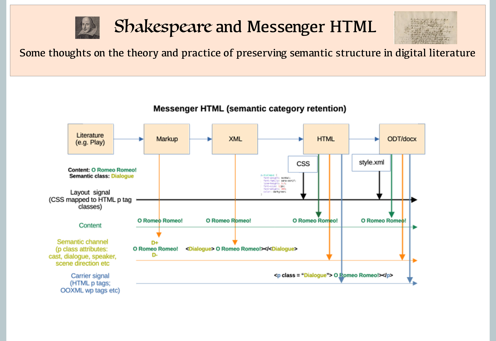
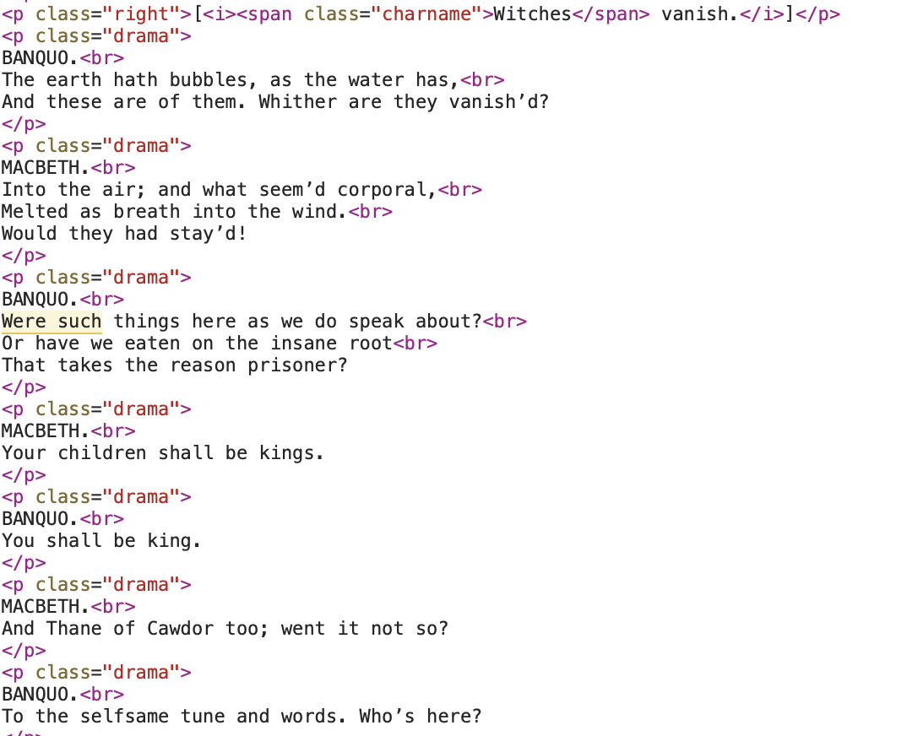
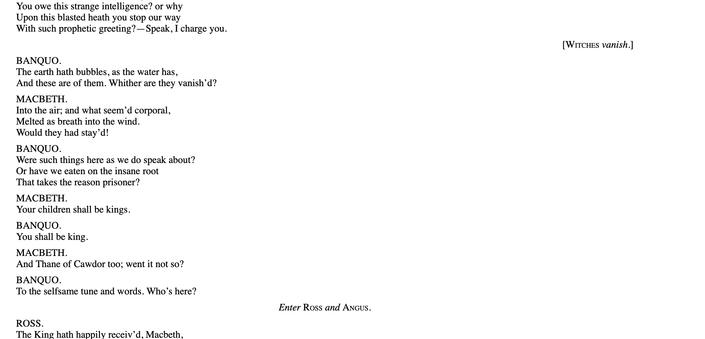
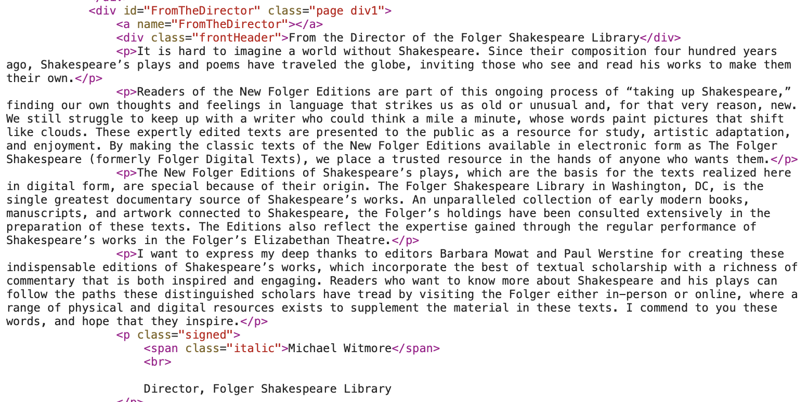
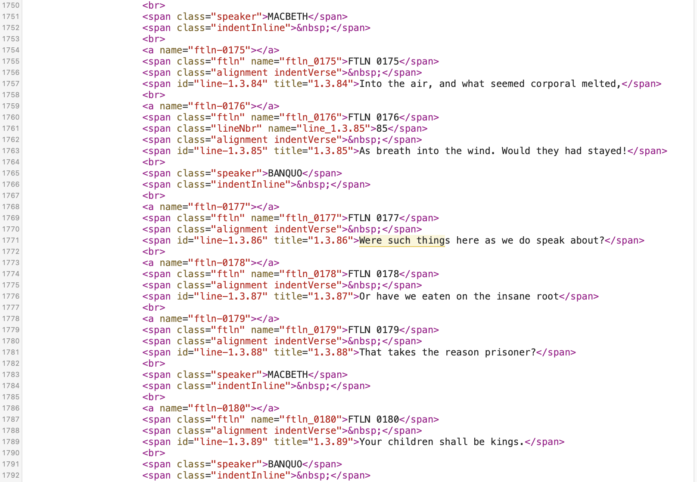
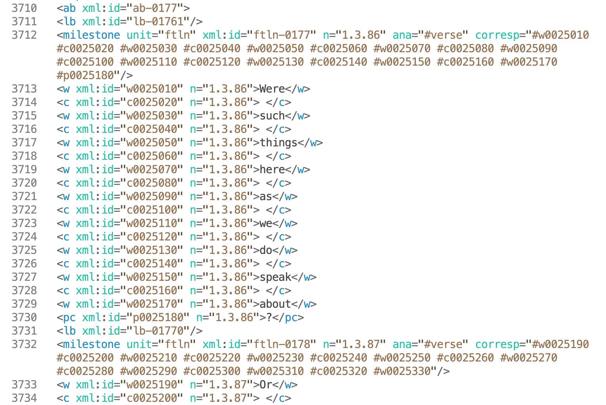
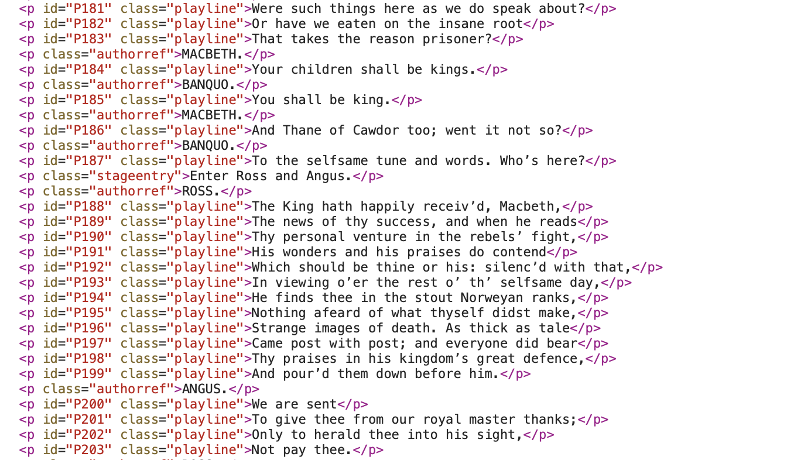

Shakespeare and HTML for Literature
-----------------

*(Open Data and The Freedom To Be or Not to Be Semantic)*

A:Craig Duncan

D:12 September 2024

# Shakespeare and MessengerHTML

The entire toolchain, written in Python (&lt; 200kB) produces HTML output for browsers that is also compatible with the usual word-processing environments, and requiring no third party file converters (simply open as HTML and styles are imported as well as semantic categories as style names).  Other toolchains, including those using pandocs, often do not do this.  

By needing to balance the author's semantic categories, on one side, and the demands of word processors, on the other, the toolchain required a holistic design and a cleaner, semantically-orientated HTML.   The author has used R Studio and similar applications to build markdown based HTML, but at over 1 GB those applications are far bigger than necessary for the task at hand, and not as focussed on semantics.

The software design specifications for producing MessengerHTML as standard output include : 

- making the text file both a raw data and scripting environment to automate HTML table creation and image annotation (unlike notebooks which are themselves HTML formats);
- adopting word processing conventions like automatic paragraph numbering for HTML output, as well as enabling paragraphs to be link targets;
- automating index creation by date and article, and creating a Site Map that inherits the structure of the source folders, for flexible modification;
- ensuring the resultant HTML is ready to be opened in native word processors like LibreOffice or MS Word, without loss of semantic or style information (i.e. styles are semantics);
- ensuring HTML is clean, javascript free and can be read independently of its CSS file if required; and
- making the application modular, and as small as possible.

The application is easily processing over 800 source notes and essays into an integrated, indexed static web site.  It has also been used to prepare a small travel diary website, with annotated images that are automatically resized using the Python scripts.  

# Resources

I have included a diagram that summarises the conceptual layers I use for the Messenger HTML model here:

# The diversity of digital formats in published e-literature

When HTML formats for e-readers, which are focussed on analogue outputs, are relied upon, we see a great amout of diversity in the conventions used for encoding the HTML.  The way in which semantic information is encoded is either overlooked, or not prepared comprehensively and consistently for sharing with other data-orientated applications.  For example, you might have text, HTML, XML, doc/x or PDF forms of documents, in which none of them are easily interoperable because there is no agreed standard by which the digital information is to be used, independently of the analogue representation. On the other hand, if we had encoded a document, like a play, into semantic tags like 'dialogue', 'speech', 'stage direction', then it would still be possible to apply different styles and layout to each of those tag categories, but we would retain the ability to process that information as data. 

We can illustrate this in concrete terms by comparing how Shakesepeare's plays are published at Project Gutenberg (in multiple formats) and at the Folger Shakespeare Library.   The need for different forms of text is driven by the fact that there are different 'readers' for the texts.  However, despite the ever-growing number of HTML tags, this is no closer to providing a uniform method for reading text which allows a single data standard to be interpreted in each context as it sees fit, while allowing the original semantic information to be retained.  

The answer is not to be prescriptive as to the semantic tags by which information is encoded, but to provide a common medium by which the information channel, the message itself, and the layout information is sent.  When these requirements are satisfied, it is easier to provide richer information for all purposes, rather than information which neglects semantic content in all contexts.

# Notes on the Shakespeare publishing formats

The focus on making HTML that is a response to arbitrary analogue representational goals has led to less attention given to how the underlying HTML format, which is, after all, perhaps the only form in which a web-based document could be provided, sensible in terms of being an open data format.   The questions that we can ask include - is this better, in terms of providing structured information relevant to the literature, than plain text, and if so, how?

My view is that the simplest form of data encoding that is useful is one that can wrap the plain text in a data structure (semantic categories) that is recognisable in the genre, and easy to use as computable, open data.  Unfortunately, this isn't really a focus within the most public of internet-based information.  If we start to think of the term Open Data, we really need to deal with how analogue representations and digital representations relate to one another, because instead of there being two separate concerns, we often have a lack of clarity of whether there is one, or two, or one that dominates the other.

In some areas, semantic information is now (by convention, rather than logic) associated primarily with the XML format, but there is less attention given as to whether we might weave XML into HTML and thus permit a hybrid of analogue and digital representation where the separation of concerns is maintained.

The analogue representation industry seems to dominate.  Advances in web programming languages, even the most basic, javascript, is assessed in terms of its utility for programmers of web sites, rather than how it might contribute to preparing open data formats, or saving effort on the part of those who want to decorate a text that is already in a suitable open data format.

My view is that instead of talking about Open Data in the abstract, where it concerns the web, we should be talking about the relationship between data formats, semantics and analogue representations, and thinking about the trade offs between different digital formats for computability, rather than how they perform in e-readers.  See also [Comparative Digital Document Analysis] (ComparitiveDigitalDocAnalysis.md).

Where there are opportunities to use HTML for both data and human reading, there are still opportunities that can be taken (see Project Gutenberg below)

 (such as in Project Gutenberg's HTML and ePub versions of plays, like: [Gutenberg_Macbeth](https://www.gutenberg.org/cache/epub/1533/pg1533-images.html) for Macbeth, these opportunities are not taken.  

# Project Gutenberg approach

Here are some relevant observations about the current form of Project Gutenberg's HTML documents.

The HTML form of representation in Project Gutenberg is very commendable, in that it is relatively clean, and it incorporates some degree of semantic tagging.  It illustrates something of what MessengerHTML is about.  Here is a section of the play MacBeth as it appears in the HTML at the above linked page:

A single paragraph class of 'drama' is used to include both a section of dialogue, and the charactor that is speaking it.  Because the information is separated by a line break character, there is no basis for separate computation (without further processing), nor for applying a different analogue style to the two different types of information.

Here is how the HTML provided by Project Gutenberg looks in a browser:

In terms of analogue representations, Project Gutenberg's simplicity, unlike that of the MessengerHTML approach (see [MessengerHTML](MessengerHTML.md) for examples), probably allows less nuanced control of the play's appearance that it would if it had a few more semantic categories.  The text in HTML is very similar to plain text, which raises the question, how much is added by moving from plain text to HTML for browser views, in this kind of literature?

It is the preparation of this page, and the ease of incorporating such semantic distinctions, that can make a difference to how well the data format can achieve dueal goals like open data/computability and nuanced layout in analogue format.  Semantic distinctions can easily be the same distinctions used to provide different layout.  We can go beyond simple binary categories, like 'drama' or otherwise, and adopt genre-recognisable categories like characters, dialogue or stage directions.  These could easily have been inserted into the HTML as paragraph classes, as well as providing other helpful navigation links to these sections.  

Historically, the Gutenberg project was designed to makes texts accessible on the internet.  The focus was on analogue representations in a digital medium.  It was considered less important (or perhaps, not important at all), to think about simultaneously structuring the data for further computation.   And yet, in many ways, it does succeed in keeping to the original importance of p tags and adds some semantic data in a way which is helpful.  By doing little to upset the simplicity of HTML, it succeeds in maintaining its ability to exist as a data format too.

Project Gutenberg is an excellent project, and the HTML it provides is, in my view, a better general purpose open data format for literature than either Folger's e-book form HTML, or the researcher's XML (see below).  It is likely there are opportunities to modify the workflow of Project Gutenberg to think about some of the missed opportunities for more open data for literature.  I think this includes the opportunity to incorporate semantically-informed data structuring as part of the information provided.   As such, possibilities like auto-tagging the text have also been missed.

One of the issues that is raised here, is whether an organisation that wants to publish information for public benefit has both a framework for analysis of quality of any digital document for open data, as well as a simple pipeline.  In this respect, I offer:

- [MessengerHTML](MessengerHTML.md) and [New Processor](NPGuide.md); and
- [Comparative Digital Document Analysis](ComparativeDigitalDocAnalysis.md)

# Folger Shakespeare

We can compare Gutenberg's approach to a well funded site, like the Folger Shakespeare Library, where there are resources for converting manuscripts into XML, and for providing web-based access to Shakespeare's works, in many forms of media, including audio and video (see [Folger](https://www.folger.edu)).  

You can also read the plays, like Macbeth (see [Macbeth_Read](https://www.folger.edu/explore/shakespeares-works/macbeth/read/)), and download a version of the play from there.  The downloaded version of the play is not in a single HTML file with CSS but in a zipped package, design to provide a kind of browser-as-e-reader experience.

What is also surprising is that in those downloadable formats there is DOC but not DOCX (the more recent, OOXML based format).  The DOC form is quite outdated and still in a proprietary form.  The additional benefits from that form are minimal, compared to OOXML.  At least in OOXML we have something closer to a human-readable format that exposes the nature of p tags and style information in such a way that we can consider making HTML formats compatible with it.

The HTML files for download at the Folger site produce a very aesthetically pleasing 'book form' of Shakespeare, which is clearly focussed on aesthetically pleasing analogue representation.

If you inspect the HTML you will see a very surprising thing: the basic paragraph tag system stops at about line 183, and thereafter it is just span and div tags.  To be clear, in the early part of the HTML, written notes from the Director of Folger Shakespeare, Michael Whitemore, appear in p tags, like this:

However, the play itself has a much longer stream of non p tags arranged more like this:

This is clearly arrived at in reverse - by finding some arrangement of HTML tags that suits the analogue representation that is intended.  This is, as a result, just as idiosyncratic as any kind of digital format that you might imagine.  The practical standardisation of HTML as an internet format, or some kind of easily parsable open data format, is rendered made difficult, even if not impossible.  Even though programs like Beautiful Soup could be available to do data scraping, it is an inherently time-consuming task, and one that makes even the most common place literature in- accessible for further study and enquiry in a digital form.  Of course, that might be part of the point, but for institutions that are interested in the public scrutiny of literature (especially that outside of copyright), and its longevity in a digital form, it would seem appropriate to think about <i>*both*</i> the computability of the format and its aesthetic analogue appearance. 

On the other hand, Folger does produce an XML format which is intended for more data-savvy digital humanities professionals and manuscript researches.  Here is an example of the same lines from Macbeth, given by Banquo, as they appear in the Folger XML format:

Compared to the Project Gutenberg HTML, the XML digital tagging produced by Folger goes to the other extreme, in that the data structure is not based on the recognisable semantic categories of the genre (characters, scenes, stage directions etc).  This is probably because it is intended to capture the source manuscript features in detail.  As the Folger institutes notes inside the XML:

<blockquote>The primary goal is to represent the source text faithfully, as simply as possible within the TEI P5 schema. Lineation and other typographic features from the print edition are reproduced, with the interpretations previously implicit in the print layout now made explicit in the encoding</blockquote>

The problem I have with supplying either complex HTML, or complex XML, is that neither is really 'simple'.  The comment about offering source text 'as simply as possible' is qualified by saying that it is 'within the TEI P5 schema', rather than in general.  Such schema deny the average researcher the possibility of participating in a computable, open data environment where they can easily work with digital forms of text independently of a chosen analogue representation.

It is clear from sites such as Folger, and many others, that there isn't a clear awareness, or motivation to make easy-to-parse, digital documents that are suitable for both digital processing and analogue representation across text, HTML and word processing formats.  It may be that there is not even an interest in exploring the idea.  Part of this project's goals is to raise awareness of how this can be done, particularly amongst those interested in Open Data.  

# MessengerHTML and a general approach to semantic data inclusion

There is more than one way to approach the goals of MessengerHTML in relation to what data we store in HTML, and how useful it might be.  For example, one approach used in MessengerHTML, is based on the inclusion of paragraph numbers, and semantic categories to allow that data to accompany the enclosed text line.   The use of paragraph numbers is one way to bridge the digital and analogue worlds, by providing a numbering system that is consistent between the two (this does not occur within the OOXML format for Word Processing software, for example).

This is a portion of MessengerHTML generated for the play 'Macbeth', showing both paragraph numbers and semantic categories within the p tags:

The MessengerHTML approach, without complicating features, is a resource that is one step better than plain text, and allows a lot of simple computation in any general programming language.  It makes it relatively easy to scrape text using python programs like Beautiful Soup.

Such simple computation allows people to work intelligently with texts, insert additional information, or filter it.  There is enormous scope for doing more if the original data is clean and structured, whilst remaining visible in the browser. 

see also [MessengerHTML](MessengerHTML.md)